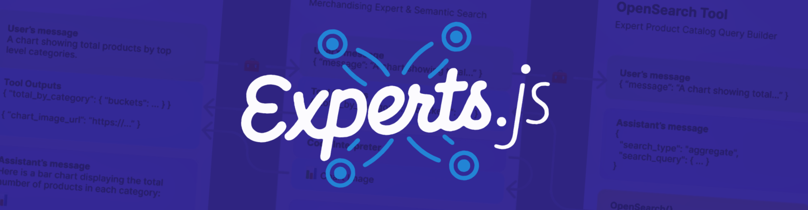
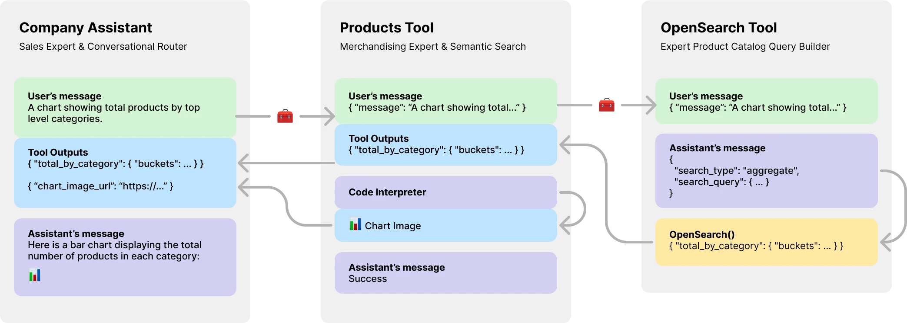
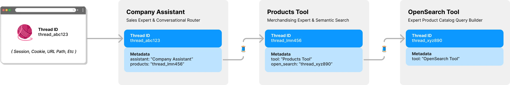

# Multi AI Agent Systems <br>using OpenAI's Assistants API (Experts.js)



Experts.js is the easiest way to create and deploy [OpenAI's Assistants](https://platform.openai.com/docs/assistants/how-it-works) and link them together as Tools to create a Panel of Experts system with expanded memory and attention to detail.

## Overview

The new Assistants API from OpenAI sets a new industry standard, significantly advancing beyond the widely adopted Chat Completions API. It represents a major leap in the usability of AI agents and the way engineers interact with LLMs. Paired with the cutting-edge [GPT-4o](https://openai.com/index/hello-gpt-4o/) model, Assistants can now reference attached files & images as knowledge sources within a managed context window called a [Thread](#threads). Unlike [Custom GPTs](https://openai.com/index/introducing-gpts/), Assistants support instructions up to 256,000 characters, integrate with 128 tools, and utilize the innovative [Vector Store](https://platform.openai.com/docs/assistants/tools/file-search/vector-stores) API for efficient file search on up to 10,000 files per assistant.

Experts.js aims to simplify the usage of this new API by removing the complexity of managing [Run](https://platform.openai.com/docs/assistants/how-it-works/runs-and-run-steps) objects and allowing Assistants to be linked together as Tools.

```javascript
const thread = Thread.create();
const assistant = await MyAssistant.create();
const output = await assistant.ask("Say hello.", thread.id);
console.log(output) // Hello
```

More importantly, Experts.js introduces Assistants as [Tools](#tools), enabling the creation of [Multi AI Agent Systems](https://twitter.com/AndrewYNg/status/1790769732146307308). Each Tool is an LLM-backed Assistant that can take on specialized roles or fulfill complex tasks on behalf of their parent [Assistant](#assistants) or Tool. Allowing for complex orchestration workflows or choreographing a series of tightly knit tasks. Shown here is an example of a company assistant with a product catalog tool which itself has a LLM backed tool to create OpenSearch queries. 



## Installation

Install via npm. Usage is very simple, there are only three objects to import.

```bash
npm install experts
```

```javascript
import { Assistant, Tool, Thread } from "experts";
```

* [Assistants](#assistants) - The main object that represents an AI agent.
* [Tools](#tools) - An Assistant that can be used by other Assistants.
* [Threads](#threads) - A managed context window for your agents.

## Assistants

The constructor of our [Assistant](https://platform.openai.com/docs/assistants/how-it-works/creating-assistants) facade object requires a name, description, and instructions. The third argument is a set of options which directly maps to all the request body options outlined in the [create assistant](https://platform.openai.com/docs/api-reference/assistants/createAssistant) documentation. All examples in Experts.js are written in ES6 classes for simplicity. The default model is `gpt-4o`.

```javascript
class MyAssistant extends Assistant {
  constructor() {
    const name = "My Assistant";
    const description = "...";
    const instructions = "..."
    super(name, description, instructions, {
      model: "gpt-4-turbo",
      tools: [{ type: "file_search" }],
      temperature: 0.1,
      tool_resources: {
        file_search: {
          vector_store_ids: [process.env.VECTOR_STORE_ID],
        },
      },
    });
  }
}

const assistant = await MyAssistant.create();
```

The Experts.js async `create()` function will: 

* Find or create your assistant by name.
* Updates the assistants configurations to latest. [(pending)](https://github.com/metaskills/experts/issues/2)

### Simple Ask Interface

The `ask()` function is a simple interface to ask or instruct your assistant(s). It requires a message and a thread identifier. More on [Threads](#threads) below. The message can be a string or native OpenAI message object. This is where Experts.js really shines. You never have to manage [Run](https://platform.openai.com/docs/assistants/how-it-works/runs-and-run-steps) objects or their [Run Steps](https://platform.openai.com/docs/assistants/how-it-works/run-steps) directly.

```javascript
const output = await assistant.ask("...", threadID)
const output = await assistant.ask({ role: "user", content: "..." }, threadID);
```

### Adding Tools

Normal OpenAI [tools and function calling](https://platform.openai.com/docs/assistants/tools/function-calling) are supported via our constructors options object via `tools` and `tool_resources`. Experts.js also supports adding [Assistants](#assistants) as Tools. More information on using Assistants as [Tools](#tools) can be found in the next section. Use the `addAssistantTool` function to add an Assistant as a Tool.

```javascript
class MainAssistant extends Assistant {
  constructor() {
    const name = "Company Assistant;
    const description = "...";
    const instructions = "...";
    super(name, description, instructions);
    this.addAssistantTool(ProductsTools);
  }
}
```

### Streaming & Events

By default all Experts.js leverages the [Assistants Streaming Events](https://platform.openai.com/docs/api-reference/assistants-streaming/events). These allow your applications to receive text, image, and tool outputs via OpenAI's server-send events. We lever the [openai-node](https://github.com/openai/openai-node/blob/master/helpers.md) stream helpers and surface these and more so you can be in control of all events in your agentic applications.


```javascript
const assistant = await MainAssistant.create();
assistant.on("textDelta", (delta, _snapshot) => {
  process.stdout.write(delta.value)
});
```

All openai-node [streaming events](https://github.com/openai/openai-node/blob/master/helpers.md) are supported via our Assistant's `on()` function. The available event names are: `event`, `textDelta`, `textDone`, `imageFileDone`, `toolCallDelta`, `runStepDone`, `toolCallDone`, and `end`

> [!IMPORTANT]  
> OpenAI's server-send events are not async/await friendly. 

If your listeners need to perform work in an async fashion, such as redirecting tool outputs, consider using our extensions to these events. They are called in this order after the Run has been completed. The available async event names are: `textDoneAsync`, `imageFileDoneAsync`, `runStepDoneAsync`, `toolCallDoneAsync`, and `endAsync`.

### Advanced Features

If you want to lazily standup additional resources when an assistant's `create()` function is called, implement the `beforeInit()` function in your class. This is an async method that will be called before the assistant is created.

```javascript
async beforeInit() {
  await this.#createFileSearch();
}
```

All Assistant events receive an extra Experts'js metadata argument. An object that contains the Run's `stream`. This allows you to use the [openai-node's helper functions](https://github.com/openai/openai-node/blob/master/helpers.md#assistant-methods) such as `currentEvent`, `finalMessages`, etc.

```javascript
assistant.on("endAsync", async (metadata) => {
  await metadata.stream.finalMessages();
});
```

## Tools

Using an [Assistant](#assistants) as a Tool is central focal point of the Experts.js framework. Tools are a subclass of Assistant and encapsulate the interface for their parent objects. In this way Experts.js tools are reusable components in your agentic architecture. Our examples illustrate a basic message passing pattern, for brevity. You should leverage all of OpenAI's [tool and function calling](https://platform.openai.com/docs/assistants/tools/function-calling) features to their fullest.

```javascript
class EchoTool extends Tool {
  constructor() {
    const name = "Echo Tool";
    const description = "Echo";
    const instructions = "Echo the same text back to the user";
    super(name, description, instructions, {
      parentsTools: [
        {
          type: "function",
          function: {
            name: EchoTool.toolName,
            description: description,
            parameters: {
              type: "object",
              properties: { message: { type: "string" } },
              required: ["message"],
            },
          },
        },
      ],
    });
  }
}
```

> [!CAUTION]
> It is critical that your tool's function name use the `toolName` getter. Experts.js converts this to a snake_case string and uses the name to find the the right tool and call it. 

As such, Tool class names are important and help OpenAI's models decide which tool to call. So pick a good name for your tool class. For example, `ProductsOpenSearchTool` will be `products_open_search` and clearly helps the model infer along with the tool's description what role it performs.

Tools are added to your [Assistant](#assistants) via the `addAssistantTool` function. This function will add the tool to the assistant's tools array and update the assistant's configuration.

```javascript
class MainAssistant extends Assistant {
  constructor() {
    const name = "Company Assistant;
    const description = "...";
    const instructions = "...";
    super(name, description, instructions);
    this.addAssistantTool(EchoTool);
  }
}
```

Your Tool assistant response will automatically be submitted as the output for the parent Assistant or Tool.

### Non-LLM Tools

By default Tools are backed by an LLM `model` and perform all the same lifecycles events, runs, etc as Assistants. However, you can create a Tool that does not use any of the core Assistant's features by setting the `llm` option to `false`. When doing so, you must implement the `ask()` function in your Tool. The return value will be submitted as the tool's output.

```javascript
class AnswerTwoTool extends Tool {
  constructor() {
    // ...
    super(name, description, instructions, {
      llm: false,
      parentsTools: [...],
    });
  }
  async ask(message) {
    return ...;
  }
}
```

### Controlling Output

In complex workflows, a LLM backed Tool can be used to convert human or other LLM instructions into executable code and the result of that code (not the LLM output) would need to be submitted for your Tool's parent's outputs. For example, the `ProductsOpenSearchTool` could convert messages into OpenSearch queries, execute them, and return the results. Sub classes can implement the `answered()` function to control the output. In this case, the `output` would be an OpenSearch query and the tools outputs now contain the results of that LLM-generated query.

```javascript
async answered(output) {
  const args = JSON.parse(output);
  return await this.opensearchQuery(args);
}
```

Alternatively, LLM backed Tools could opt to redirect their own tool outputs back to their parent Assistant or Tool. Thus ignoring the LLM output. This also allows for all of a Tools tool outputs to be submitted as the parent's output. More on why this is important in the [product catalog](#product-catalog) example below.

```javascript
class ProductsTool extends Tool {
  constructor() {
    // ...
    super(name, description, instructions, {
      temperature: 0.1,
      tools: [{ type: "code_interpreter" }],
      outputs: "tools",
      parentsTools: [...],
    });
    this.addAssistantTool(ProductsOpenSearchTool);
    this.on("imageFileDoneAsync", this.imageFileDoneAsync.bind(this));
  }
}
```

## Threads

OpenAI's Assistants API introduces a new resource called [Threads](https://platform.openai.com/docs/assistants/how-it-works/managing-threads-and-messages) which messages & files are stored within. Essentially, threads are a managed context window (memory) for your agents. Creating a new thread with Experts.js is as easy as:

```javascript
const thread = Thread.create();
console.log(thread.id) // thread_abc123
```

You can also create a thread with messages, files, or tool resources to start a conversation. We support OpenAI's thread create request body outlined in their [Threads API](https://platform.openai.com/docs/api-reference/threads) reference.

```javascript
const thread = await Thread.create({
  messages: [
    { role: "user", content: "My name is Ken" },
    { role: "user", content: "Oh, my last name is Collins" },
  ],
});
const output = await assistant.ask("What is my full name?", thread.id);
console.log(output) // Ken Collins
```

### Thread Management & Locks

By default, each [Tool](#tools) in Experts.js has its own thread & context. This avoids a potential [thread locking](https://platform.openai.com/docs/assistants/how-it-works/thread-locks) issue which happens if a [Tool](#tools) were to share an [Assistant's](#assistants) thread still waiting for tool outputs to be submitted. The following diagram illustrates how Experts.js manages threads on your behalf to avoid this problem:



All questions to your experts require a thread ID. For chat applications, the ID would be stored on the client. Such as a URL path parameter. With Expert.js, no other client-side IDs are needed. As each [Assistant](#assistants) calls an LLM backed [Tool](#tools), it will find or create a thread for that tool as needed. Experts.js stores this parent -> child thread relationship for you using OpenAI's [thread metadata](https://platform.openai.com/docs/api-reference/threads/modifyThread).

## Examples

To see code examples of these and more in action, please take a look at our [test suite](https://github.com/metaskills/experts/tree/main/test/uat). 

### Product Catalog

In the [Overview](#overview) section we showed a three-tiered agent system that can answer the following types of questions. The examples uses most, if not all, the features of the Experts.js framework.

* What is the total amount of products available?
* Show me a bar chart image with totals of all top level categories.
* Find men's accessories for a sophisticated comic book enthusiast.

### Streaming From Express

Basic example using the `textDelta` event to stream responses from an Express route.

```javascript
import express from "express";
import { MainAssistant } from "../experts/main.js";

const assistant = await MainAssistant.create();

messagesRouter.post("", async (req, res, next) => {
  res.setHeader("Content-Type", "text/plain");
  res.setHeader("Transfer-Encoding", "chunked");
  assistant.on("textDelta", (delta, _snapshot) => {
    res.write(delta.value);
  });
  await assistant.ask(req.body.message.content, req.body.threadID);
  res.end();
});
```

### Messages With Images

The Assistant's API supports messages with images using either the `image_url` or `image_file` content types. Since our `ask()` function supports strings or native OpenAI message objects.

```javascript
const output = await assistant.ask(
  { 
    role: "user", 
    content: [
      { type: "text", text: "Tell me about this image." },
      { type: "image_file", image_file: { file_id: file.id detail: "high" } },
    ],
  },
  threadID
);
```

### Vector Store

Using a [Vector Store](https://platform.openai.com/docs/assistants/tools/file-search/vector-stores) for file search is easy using OpenAI's interface via our third configuration option. You could alternatively create your vector store on-demand using our `beforeInit()` function described in [Advanced Features](#advanced-features).

```javascript

class VectorSearchAssistant extends Assistant {
  constructor() {
    const name = "Vector Search Assistant";
    const description = "...";
    const instructions = "..."
    super(name, description, instructions, {
      tools: [{ type: "file_search" }],
      temperature: 0.1,
      tool_resources: {
        file_search: {
          vector_store_ids: [process.env.VECTOR_STORE_ID],
        },
      },
    });
  }
}
```

### Token Usage Metrics

Using the [Streaming & Events](#streaming--events) feature to report token usage allows you to have per-assistant metrics.

```javascript
class MyAssistant extends Assistant {
  constructor() {
    // ...
    super(name, description, instructions);
    this.on("runStepDone", this.#reportUsage.bind(this));
  }

  #reportUsage(runStep) {
    if (!runStep?.usage?.total_tokens) return;
    const iT = runStep.usage.prompt_tokens;
    const oT = runStep.usage.completion_tokens;
    const tT = runStep.usage.total_tokens;
    console.log({ InTokens: iT, OutTokens: oT, TotalTokens: tT });
  }
}
```

## Development Setup

This project leverages [Dev Containers](https://containers.dev/) meaning you can open it in any supporting IDE to get started right away. This includes using [VS Code with Dev Containers](https://www.youtube.com/watch?v=b1RavPr_878) which is the recommended approach.

Once opened in your development container, create a `.env.development.local` file with your OpenAI API key and [postimage.org](https://postimages.org) API key:

```
OPENAI_API_KEY=sk-...
POST_IMAGES_API_KEY=...
```

Now you can run the following commands:

```bash
./bin/setup
./bin/test
```

## Scratch

```javascript
const thread = Thread.create();
const assistant = await MyAssistant.create();
const output = assistant.ask("Hi, how are you?", thread.id);
```
